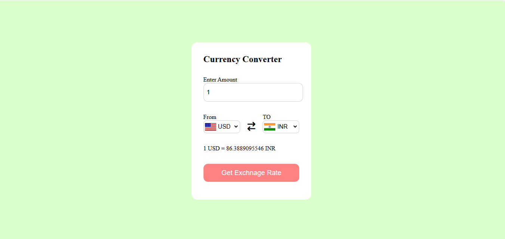

# 💱 Currency Converter

A simple and user-friendly **currency converter** web application built using **HTML**, **CSS**, and **JavaScript**. It allows users to convert one currency to another in real-time using live exchange rates.



## 🚀 Features

- Convert between major international currencies
- Real-time exchange rates
- Easy-to-use and responsive user interface
- Clean and minimal UI built with React

## 🛠️ Technologies Used

- React
- HTML/CSS
- JavaScript (ES6+)
- Currency Exchange API (like exchangerate-api.com or any other you may have used)

## 📁 Folder Structure

CURRENCY-CONVERTER/
├── node_modules/
├── public/
├── src/
│ ├── components/
│ ├── App.js
│ ├── index.js
│ └── ...
├── image/
│ └── 1.png
├── package.json
├── README.md
└── ...


## ⚙️ Setup Instructions

1. Clone the repository:

```bash
git clone https://github.com/Shashank172003/CURRENCY-CONVERTER.git
cd CURRENCY-CONVERTER
npm install
npm start
```
